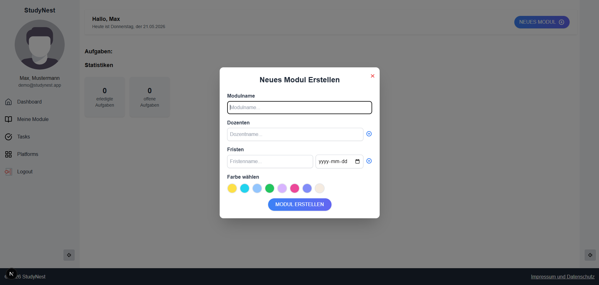
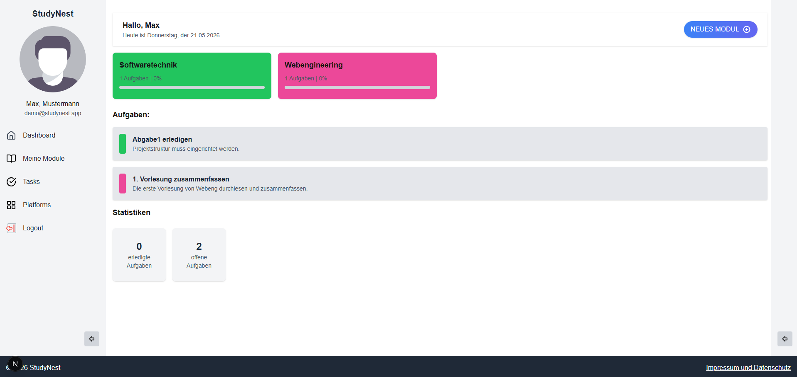
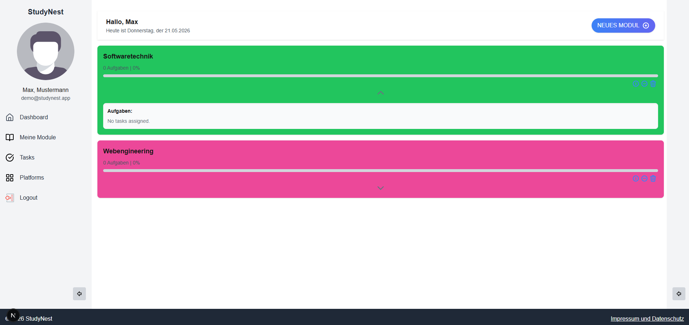
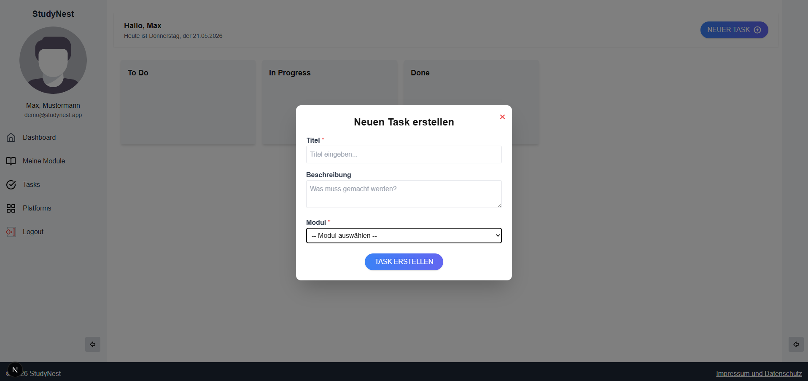
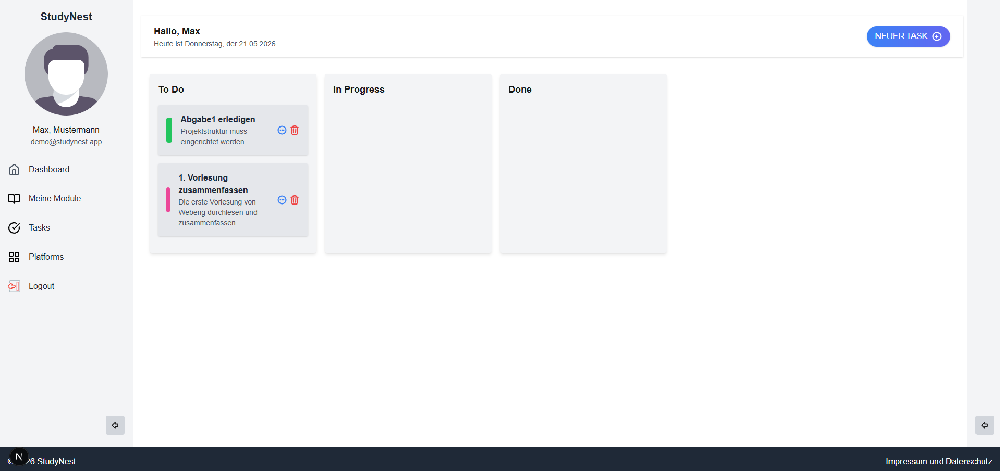
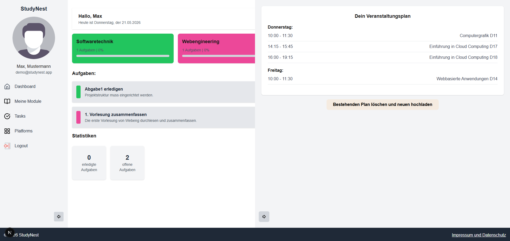
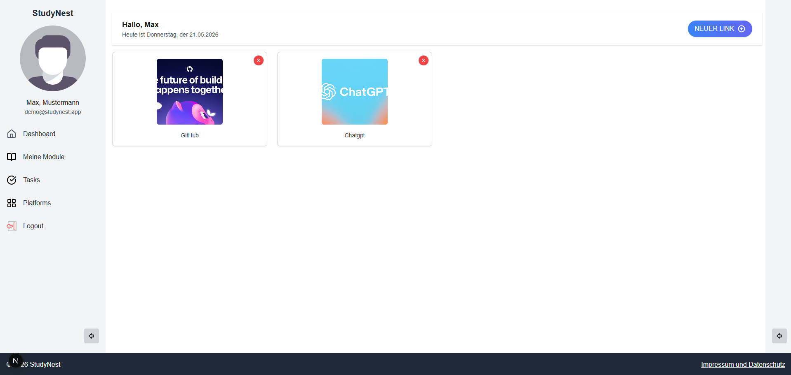

# StudyNest

StudyNest is a full-stack web application developed as part of a university Web Engineering module.

The project represents a student platform and demonstrates modern tooling, authentication, data handling, and a clear separation between frontend and backend.

The original project included an Express backend. For the deployed portfolio version, authentication and data handling are implemented with Firebase client-side services.

---

## Preview

### Login Page


### Dashboard




### Meine-Module



### Task Board




### Schedule Integration



### Platforms Section



## Tech Stack

### Frontend

- Next.js
- React
- TypeScript
- Tailwind CSS
- Vitest

### Backend

- Node.js
- Express
- Firebase Admin SDK
- Firestore

---

## Project Structure

```
studynest/
├── frontend/   # Next.js frontend application
├── backend/    # Node.js / Express backend
├── tests/      # Test setup
└── README.md
```

Both frontend and backend are independent npm projects and must be installed separately.

---

## Local Development

### Prerequisites

- Node.js (version 18–20 recommended)
- npm
- Firebase project configuration

---

### 1. Clone the repository

```bash
git clone https://github.com/H-Sakah/studynest.git
cd studynest
```

---

### 2. Start the backend

```bash
cd backend
npm install
npm start
```

The backend will run on:

```
http://localhost:4000
```

---

### 3. Start the frontend (new terminal)

```bash
cd frontend
npm install
npm run dev
```

The frontend will be available at:

```
http://localhost:3000
```

---

## Authentication & Configuration

This project uses Firebase for authentication and data storage.

Sensitive configuration files (e.g. Firebase service account credentials) are intentionally **not included** in this repository.  
To run the backend with full functionality, a valid Firebase Admin configuration must be provided locally.

---

## Security Note

Development-only dependency warnings may appear during `npm audit`. These do **not** affect production builds.

---

## Contributors

- Houssam Sakah
- Ivan Misic
- Oussama Mabchour
